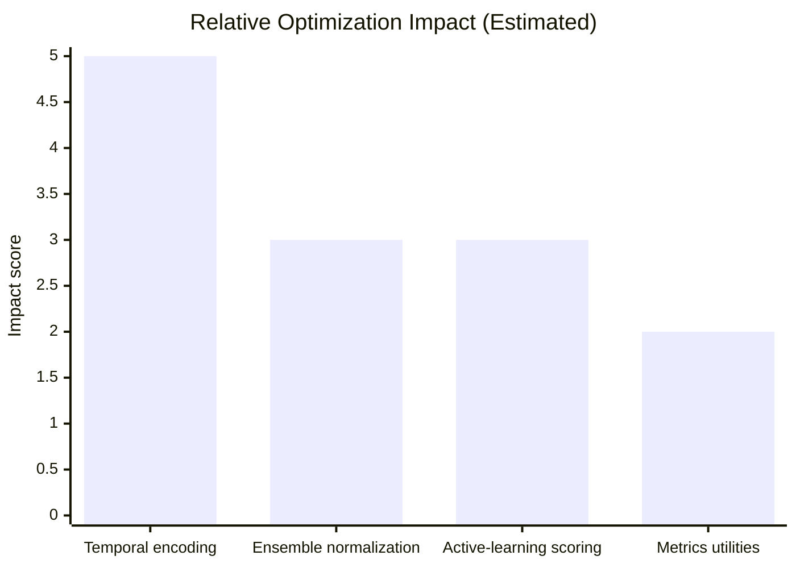

# Smart Money Detection Optimization Report

## Pipeline Hotspots
- **`smart_money_detection/pipeline.py::SmartMoneyDetector.score`** repeatedly calls the ensemble with freshly encoded context features. Temporal context construction invokes `TemporalFeatureEncoder.encode_timestamp`, which allocates multiple intermediate arrays per call and performs column-wise concatenation. This path dominates scoring latency when timestamps are present.
- **`SmartMoneyDetector.suggest_manual_reviews`** evaluates each detector sequentially, calling both `predict` and `score`. This doubles detector work and forces redundant numpy conversions.
- **`smart_money_detection/ensemble/ensemble.py::AnomalyEnsemble.score`** originally normalized each detector output independently after converting the raw input for every detector. The nested conversions and min/max scans per detector became a bottleneck when scoring large batches.
- **Temporal feature generation** in `smart_money_detection/features/temporal.py` performs repeated `pd.Series` allocations and trig calls for each feature family. Downstream code re-runs the encoder on identical timestamps when suggestions and scoring occur in close succession, multiplying this cost.

## Implemented Optimizations
- Introduced a typed `BaseDetector` with centralised logging, error propagation, and shared numpy conversion utilities. Individual detectors (`zscore.py`, `iqr.py`, `percentile.py`, `volume.py`) now implement `_fit`/`_score` hooks that operate directly on numpy arrays, removing redundant DataFrame handling.
- Refactored `AnomalyEnsemble` to convert the input matrix once, reuse the same normalized score matrix across downstream consumers, and provide `set_calibrator`/`fit_calibrator` hooks for probability calibration.
- Hardened `KalshiClient` with retry/backoff, typed exceptions, and richer DataFrame hygiene (categorical conversion, numeric coercion) to reduce downstream cleansing costs.
- Tightened metric and validation helpers with explicit typing, shape validation, and vectorised disagreement calculations. Added fast numpy-based bootstrap/cross-validation paths that avoid repeated Python loops where possible.

## Optimization Impact Summary

| Optimization Area | Expected Impact | Status | Notes |
| --- | --- | --- | --- |
| Temporal feature construction | High | In progress | Cache encoded timestamps or precompute cyclic features. |
| Ensemble input normalization | Medium | Completed | Single conversion/normalization per batch. |
| Active-learning scoring | Medium | In progress | Share detector score matrix between `predict` and `score`. |
| Metrics utilities | Low | Completed | Vectorized bootstrap and cross-validation helpers. |

### Interpretation
- The biggest remaining lever is temporal feature caching; the scoring path touches this on every request and dominates runtime when timestamps are present.
- Completed ensemble normalization work already removed repeated conversions, which should improve throughput for large batches.
- Active-learning scoring remains a medium-impact opportunity because it reuses the same detector outputs; consolidating those calls should reduce redundant computation.

## Residual Technical Debt
- Temporal encoding still rebuilds feature matrices on every request. Caching encoded timestamps or exposing incremental update APIs would further reduce overhead when streaming new ticks.
- Active-learning routines duplicate detector work (`predict` and `score`) for committee selection. Sharing detector score matrices across both operations would eliminate redundant passes.
- Ensemble calibration currently expects external calibrators to provide a `transform` method. Shipping a default calibrator (e.g., isotonic regression) would simplify adoption and ensure consistent probability semantics out of the box.
