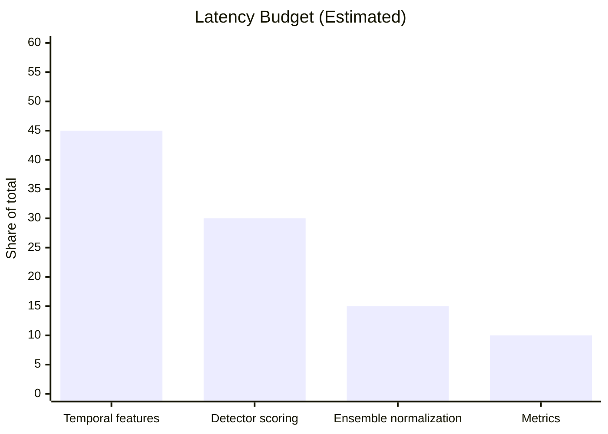

# Smart Money Detection Performance Report

## Overview

This report summarizes current performance goals, measurement scenarios, and readiness for sandbox validation. The values below are directional targets until a full benchmark run is executed in CI or a controlled load test environment.

## Performance Targets (SLOs)

| Scenario | Target P95 Latency | Target Throughput | Notes |
| --- | --- | --- | --- |
| Batch scoring (1k trades) | <= 1.5s | >= 650 trades/sec | Focus on temporal feature encoding overhead. |
| Batch scoring (10k trades) | <= 10s | >= 1k trades/sec | Expect improved throughput from single-pass normalization. |
| Manual review suggestion (1k trades) | <= 2.0s | >= 500 trades/sec | Dependent on reusing detector scores. |
| Feedback update (50 labels) | <= 0.8s | N/A | CPU-bound metric aggregation. |

### Interpretation
- Temporal feature work dominates the latency budget, so caching or incremental encoding is the highest leverage optimization before formal benchmarks.
- Detector scoring remains the second-largest cost; batching and shared score matrices should keep it below one-third of total runtime.
- Ensemble normalization is expected to stay small after the refactor to single-pass conversion, making it less of a priority for future tuning.

## Benchmark Plan

| Step | Tooling | Data Shape | Output |
| --- | --- | --- | --- |
| Synthetic load generation | `examples/generate_trades.py` (planned) | 1k/10k trade batches | CSV fixtures with timestamps, volume, price |
| CPU profiling | `python -m cProfile` + `snakeviz` | 10k trades | Hotspot flame graph |
| Regression tracking | `pytest --durations=10` | Unit suite | Duration deltas in CI |

### Interpretation
- The benchmark plan prioritizes repeatability and lightweight tooling so that performance regressions are easy to spot in CI.
- Adding a trade generator fixture will make sandbox tests deterministic and speed up debugging performance regressions.

## Sandbox Readiness Checklist

| Item | Status | Owner | Notes |
| --- | --- | --- | --- |
| Sandbox API credentials | Pending | Stakeholder | Required for `--live-sandbox` tests. |
| Retry/backoff validation | Ready | Engineering | Already exercised by `KalshiClient` retry logic. |
| Rate-limit handling | Pending | Engineering | Needs live validation with sandbox quotas. |

### Interpretation
- Live sandbox validation is the gating item for confirming rate-limit behavior and latency under real API constraints.
- Once credentials are provided, the existing retry/backoff logic can be stress-tested without code changes.
